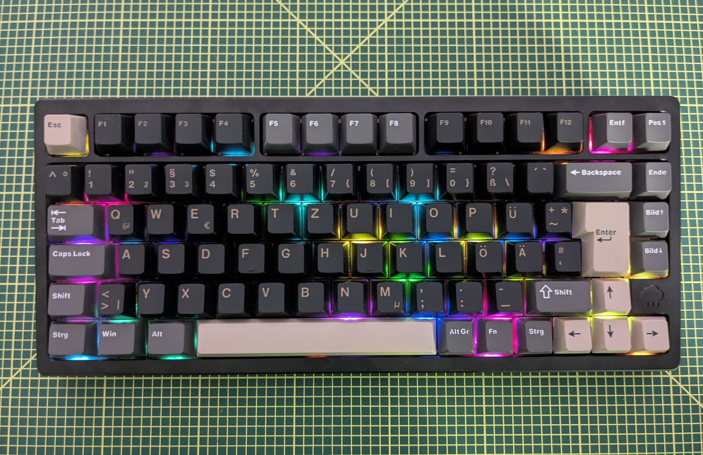
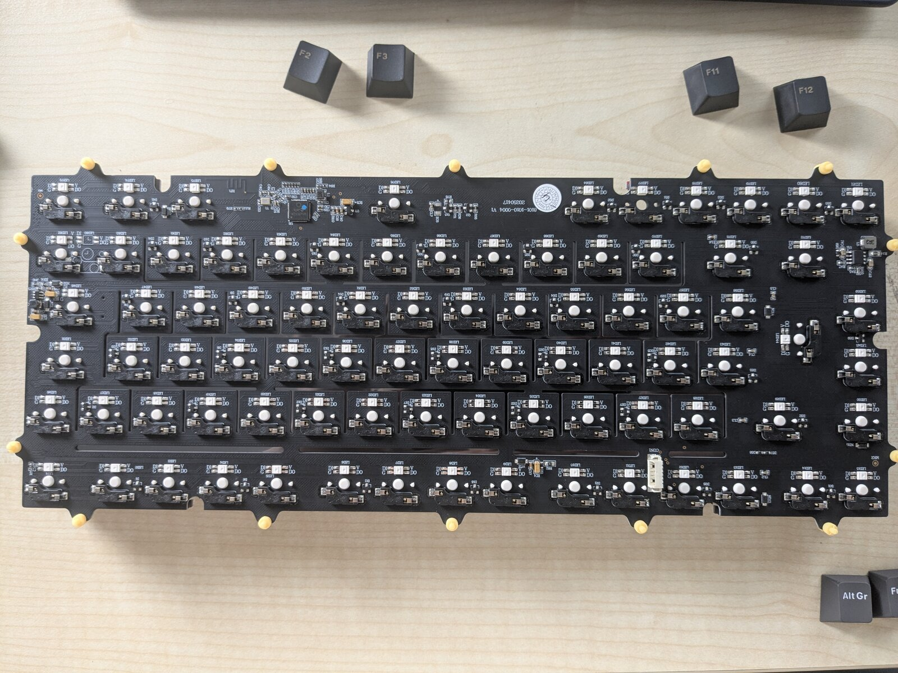
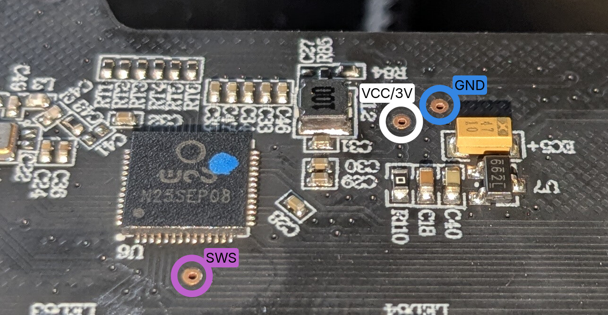
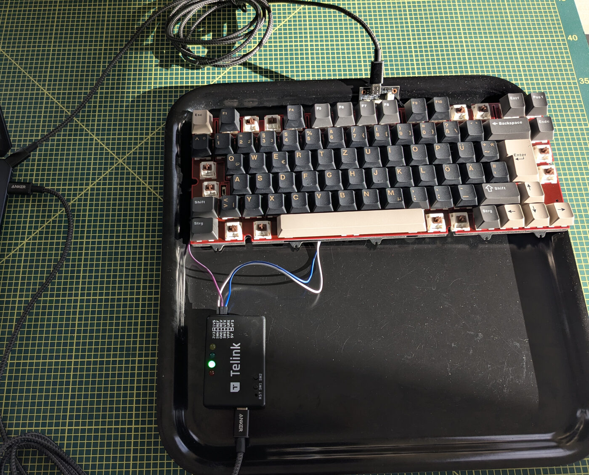
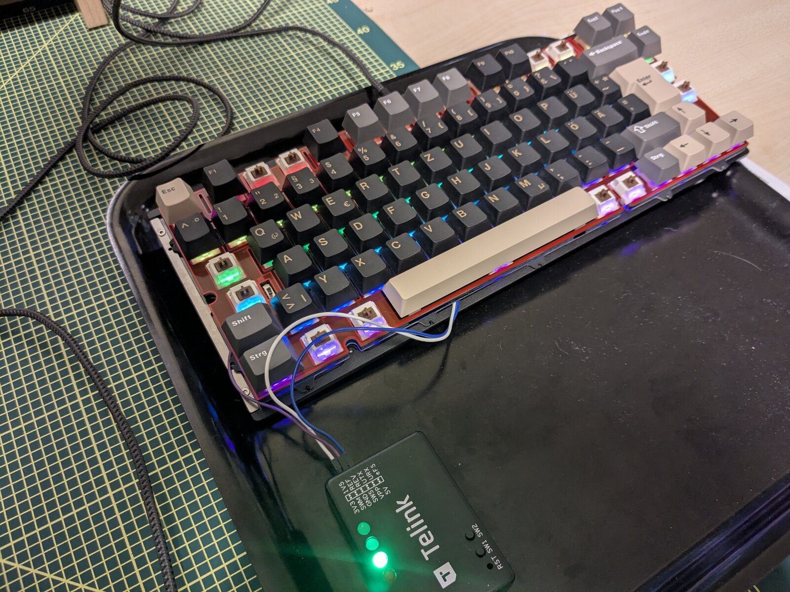

# Wobkey Rainy 75 Pro — Open ZMK Firmware & Reverse Engineering

Open-source **[ZMK](https://zmk.dev) firmware** for the Wobkey Rainy 75 Pro (ISO DE),
plus a complete **reverse-engineering writeup** of its stock firmware and hardware —
the Telink TLSR9511 (B91, RISC-V) platform shared across a dozen enthusiast keyboards.

[](LICENSE)
[](https://zmk.dev)
[-orange)](docs/architecture.md)
[](#status)



---

## What is this?

Two things in one repository:

1. **A complete, open ZMK firmware port** for the Rainy 75 Pro — USB + Bluetooth LE,
   all 83 per-key RGB LEDs, deep sleep, and a custom lighting engine. It can be flashed
   **without opening the case and without a hardware debugger**, and there is a full
   recovery path if anything goes wrong.

2. **A full reverse-engineering project** — the stock firmware (Evision proprietary,
   not QMK) and the PCB were reverse-engineered from scratch: 211/211 firmware functions
   identified, the key/HID pipeline traced, the OTA and VIA protocols decoded, and the
   GPIO matrix + RGB + BLE hardware mapped. That work is what made the ZMK port possible,
   and it is documented in full under [`docs/`](docs/).

> ### ⚠️ Flashing firmware can brick your keyboard
> This is unofficial, community firmware with **no warranty** (see [LICENSE](LICENSE)).
> Make sure you can get back first: have the **stock firmware image** ready before you
> start (download it from the official Wobkey updater — no special hardware needed; see
> [INSTALL.md](INSTALL.md)). A wrong image can leave the board unresponsive — recoverable
> only via the hardware **SWS** path with a Telink burning board
> ([recovery guide](docs/recovery.md)). Proceed at your own risk. This project is **not
> affiliated with or endorsed by Wobkey, Telink, or Evision.**

---

## Who this is for

Honest expectations first — this is an **enthusiast, build-it-yourself** project, not a
one-click flasher:

- **You build it from source.** There's no prebuilt download: the firmware links a
  proprietary Telink BLE blob that can't be redistributed, so everyone builds locally (the
  build fetches the blob for you). Expect a real Zephyr toolchain setup — Zephyr SDK 0.17.0
  + west; see [INSTALL.md](INSTALL.md#4-build-from-source).
- **Linux only.** The install/restore helpers are bash + [`mcumgr`](https://github.com/apache/mynewt-mcumgr-cli)
  (`/dev/ttyACM*`, udev rules). macOS/Windows aren't covered yet.
- **Comfortable in a terminal.** You'll build, install `mcumgr`, add udev rules, and run
  flashing scripts — there's no GUI.
- **It replaces the stock experience.** No VIA — remap with **ZMK Studio** (over Bluetooth,
  in Chrome/Edge). No **2.4 GHz dongle** (USB + BLE only). 6-key rollover by default.
- **Real risk.** A bad flash can leave the board needing **hardware** recovery (a Telink
  burning board on the SWS pads). Keep your stock image. Proceed at your own risk.

Not your cup of tea? The [reverse-engineering writeups](#reverse-engineering) are worth a
read on their own.

---

## Highlights

- **Runs ZMK** — the modern, open keyboard firmware: define your keymap in devicetree,
  flash over USB, no proprietary tools.
- **Wired + wireless** — USB-C and Bluetooth LE (HID-over-GATT, bonding). 6-key rollover
  (the ZMK default; NKRO can be enabled in config). *The stock 2.4 GHz dongle uses a
  proprietary protocol and is **not** ported — see [Known limitations](#known-limitations).*
- **`rainy_rgb` lighting engine** — a custom, out-of-tree engine driving all 83 per-key
  WS2812 LEDs: 11 animated effects, reactive ripple/heatmap, FPS-independent speed, and
  *functional* indicators (CapsLock, Fn-layer highlight, battery gauge) — see
  [docs/rainy-rgb.md](docs/rainy-rgb.md).
- **No debugger needed to install** — once you've built the images, a two-stage OTA →
  mcumgr DFU path flashes ZMK over the stock firmware's own update protocol with
  `./install_zmk.sh` (no opening the case, no hardware programmer).
- **Reversible** — `./restore_stock.sh` puts the original firmware back.
- **Deep sleep** — ~µA retention with wake-on-keypress for real wireless battery life.
- **Fully reverse-engineered** — 211/211 stock-firmware functions named; hardware,
  protocols, and platform documented for anyone porting a sibling board.

---

## Gallery

| | |
|---|---|
| <br>*Motherboard — TLSR9511 (B91)* | <br>*SWS / GND / VCC recovery pads* |
| <br>*Telink EVK recovery wiring* | <br>*`rainy_rgb` per-key effects* |

---

## Quick facts

| Property | Value |
|----------|-------|
| MCU | **Telink TLSR9511** (B91-series), QFN56, RISC-V |
| CPU core | Andes D25F — RV32IMACF + Andes V5 extensions |
| Flash / SRAM | 1 MB / 256 KB |
| USB VID:PID | `320F:5055` (stock) |
| Layout | 75% ISO, 83 keys |
| Matrix | 8×16 (16 columns + 7 rows), column-to-row scan |
| RGB | **83** per-key WS2812 — PB7 (PSPI MOSI), DMA ch4, ~6 MHz |
| Connectivity (this firmware) | USB-C + Bluetooth LE, 6-key rollover (NKRO via config) |
| Hardware radios | USB-C · BLE · 2.4 GHz dongle (the 2.4 GHz mode is **not** ported) |
| Battery | 2× 3500 mAh LiPo (7000 mAh) |
| Stock firmware | Evision proprietary platform (**not** QMK), VIA V3 |

---

## Getting started

> Read the [⚠️ warning](#️-flashing-firmware-can-brick-your-keyboard) first, and have the
> **stock firmware image** ready (from the official Wobkey updater) so you can get back.

| I want to… | How |
|------------|-----|
| **Install this ZMK firmware** | `./install_zmk.sh` — two-stage OTA → mcumgr, no debugger. Full guide: [INSTALL.md](INSTALL.md). |
| **Use it — controls, Bluetooth, Studio** | [docs/usage.md](docs/usage.md) — Fn-layer, BT profiles + reset, live keymap editing via ZMK Studio. |
| **Go back to stock** | `./restore_stock.sh` — see [INSTALL.md](INSTALL.md#3-go-back-to-stock). |
| **Build from source** | `./build.sh -a` (Zephyr SDK 0.17.0 + west). See [INSTALL.md](INSTALL.md#4-build-from-source). |
| **Recover a bricked board** | Telink burning board over the SWS pads — [docs/recovery.md](docs/recovery.md). |
| **Open the case / service the battery** | Photo teardown walkthrough — [docs/teardown.md](docs/teardown.md). |
| **Customize the keymap / RGB** | Edit `zmk/boards/rainy75/rainy75.keymap`; RGB controls in [docs/rainy-rgb.md](docs/rainy-rgb.md). |
| **Use the ANSI layout** | Build with `-DCONFIG_RAINY75_ANSI=y` — experimental/untested, see [INSTALL.md](INSTALL.md#ansi-layout-experimental-untested). |
| **Contribute** | [CONTRIBUTING.md](CONTRIBUTING.md). |

---

## The ZMK firmware

A Zephyr module under [`zmk/`](zmk/) provides everything the Rainy 75 needs that isn't
upstream yet — written as out-of-tree drivers so it survives ZMK upgrades:

- **BLE HCI driver** around Telink's BLE controller blob (peripheral HID-over-GATT)
- **USB device driver** (legacy `usb_dc` API) — HID + CDC-ACM console
- **WS2812 LED-strip driver** — PSPI + DMA, interrupt-driven, drives the 83 per-key LEDs
- **Battery ADC**, **hardware watchdog**, and **deep-sleep** power management
- **MCUboot** bootloader with mcumgr DFU (USB-CDC) and a watchdog crash-revert safety net
- **`rainy_rgb`** — the custom lighting engine that replaces ZMK's underglow

Full build/flash/bring-up details: [docs/zmk-firmware.md](docs/zmk-firmware.md) ·
lighting engine: [docs/rainy-rgb.md](docs/rainy-rgb.md).

---

## Known limitations

- **2.4 GHz dongle** — the stock 2.4 GHz USB dongle uses a proprietary RF protocol that
  isn't reverse-engineered or implemented here. This firmware is **USB + BLE only**.
- **Battery percentage** — the battery ADC (pin / divider / Vref) isn't hardware-validated,
  so the gauge is approximate.
- **ANSI layout** — experimental and unverified on real hardware
  ([help wanted](CONTRIBUTING.md#layout-variants-iso--ansi)).

---

## Reverse engineering

The stock firmware ships no source. Everything here was recovered from a flash dump and
live probing. The writeups under [`docs/`](docs/):

| Document | Contents |
|----------|----------|
| [Teardown](docs/teardown.md) | Photo walkthrough: opening the case, the PCB, battery, daughterboard |
| [Architecture](docs/architecture.md) | MCU, USB enumeration, HID interfaces, RGB, battery, connection modes |
| [GPIO & Matrix](docs/gpio-matrix.md) | Pin mapping (16 col + 7 row), scan method, timing, keymap, Fn combos |
| [GPIO Pinout](docs/gpio-pinout.md) | Full pin assignment table |
| [Firmware Analysis](docs/firmware-analysis.md) | Ghidra results, 211 functions, key pipeline, SRAM layout |
| [Protocols](docs/protocols.md) | USB-HID OTA protocol, VIA protocol, HID probe results |
| [Hardware Probing](docs/hardware-probing.md) | Test pads, SWS debug, logic analyzer, Telink burning EVK |
| [Evision Platform](docs/evision-platform.md) | Firmware ecosystem, 7+ sibling keyboards, GearHub protocol |
| [WOB Driver](docs/wob-driver-analysis.md) | wobwxe.com JS analysis, HID protocols, flash map |
| [Resources](docs/resources.md) | SDK links, datasheet, reference projects |

> The decompiled stock firmware itself, the vendor datasheet, and the Ghidra project are
> **intentionally not included** (they are proprietary third-party material). The docs
> above are original analysis. See [NOTICE](NOTICE).

---

## Repository layout

```
zmk/                  # Our Zephyr module: board def, out-of-tree drivers, rainy_rgb engine
  boards/rainy75/     # Board definition (DTS, keymap, defconfig)
  drivers/            # BLE / USB / LED-strip / battery / watchdog drivers
  src/rainy_rgb/      # Custom RGB lighting engine
  lib/                # Telink BLE blob — fetched by fetch_ble_blob.sh, not committed
conf/                 # Build configuration overlays (app / mcuboot / ota-bridge)
patches/             # Small Zephyr patches (applied by west)
docs/                 # Reverse-engineering writeups + firmware docs
reverse/tools/        # USB/HID tools: OTA flasher, VIA probes, stock-firmware extractor, SWS helper
fetch_ble_blob.sh     # Downloads the (non-redistributable) Telink BLE blob at build time
install_zmk.sh        # Stock → ZMK (OTA bridge + mcumgr)
restore_stock.sh      # ZMK → stock
build.sh              # Build MCUboot + app (+ combined / bridge)
```

---

## Contributing

Issues and pull requests are welcome — keymap tweaks, new RGB effects, sibling-board
ports, driver fixes, and documentation all help. See **[CONTRIBUTING.md](CONTRIBUTING.md)**
for the build/test/PR workflow and the code layout.

- **Build before submitting:** `./build.sh -a` and run the engine host tests
  (`./zmk/src/rainy_rgb/tests/run_host_tests.sh`).
- **Keep it out-of-tree:** new functionality lives under `zmk/`, so the ZMK pin can be
  bumped without losing it.
- **ANSI / other layouts:** if you have an ANSI board, help verify the layout — see
  [CONTRIBUTING.md](CONTRIBUTING.md#layout-variants-iso--ansi).

---

## Built with Claude Code

This firmware and the reverse-engineering work were developed with
[Claude Code](https://claude.com/claude-code), Anthropic's agentic coding tool — from the
Ghidra analysis and driver bring-up to the docs and the publication itself. The repository
is deliberately structured to keep working with it productively:

- **[CLAUDE.md](CLAUDE.md)** — project context, key facts, and status that Claude Code
  loads automatically, so it can pick up where the work left off.
- **[docs/](docs/)** — findings written as durable, cross-linked references (not chat
  logs), which both humans and the agent can build on.

If you fork this to port a sibling board or add features, that context travels with the
repo — point Claude Code at it and go.

---

## Credits & license

- Firmware built on [ZMK](https://github.com/zmkfirmware/zmk) (MIT) and
  [Zephyr](https://github.com/zephyrproject-rtos/zephyr) (Apache-2.0).
- The Bluetooth controller blob is **fetched at build time** from
  [telink-semi](https://github.com/telink-semi) — it is proprietary and **not
  redistributed here** (see [NOTICE](NOTICE)).
- This project's own code and documentation are licensed under **Apache-2.0**
  ([LICENSE](LICENSE)).

Independent, unofficial project — not affiliated with Wobkey, Telink, or Evision.
All trademarks belong to their respective owners.
