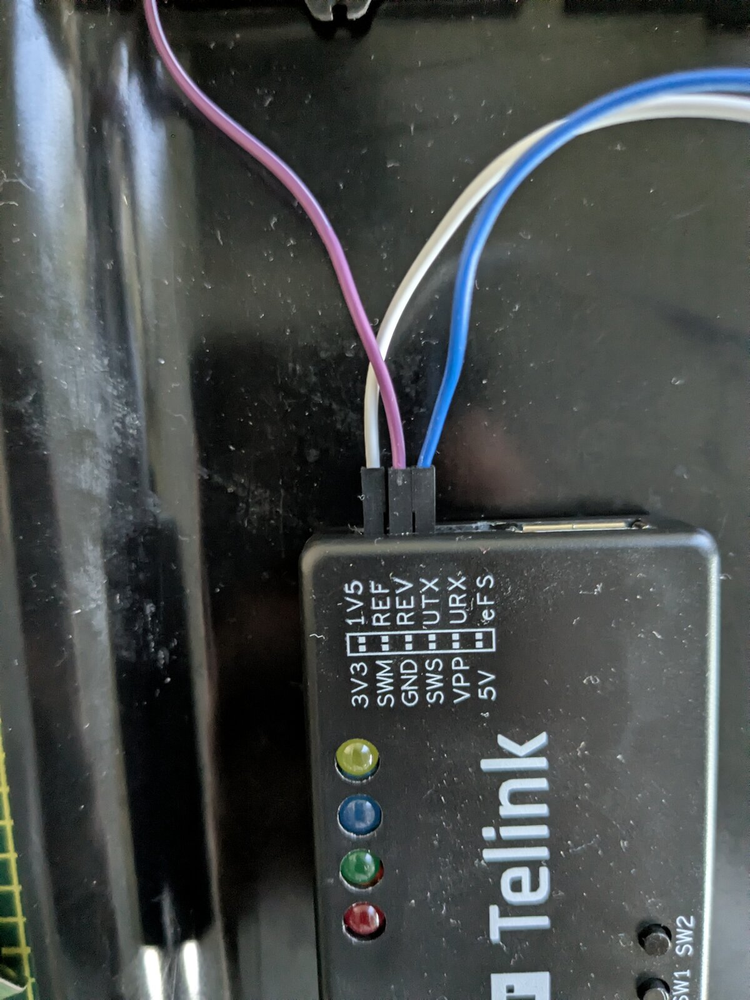
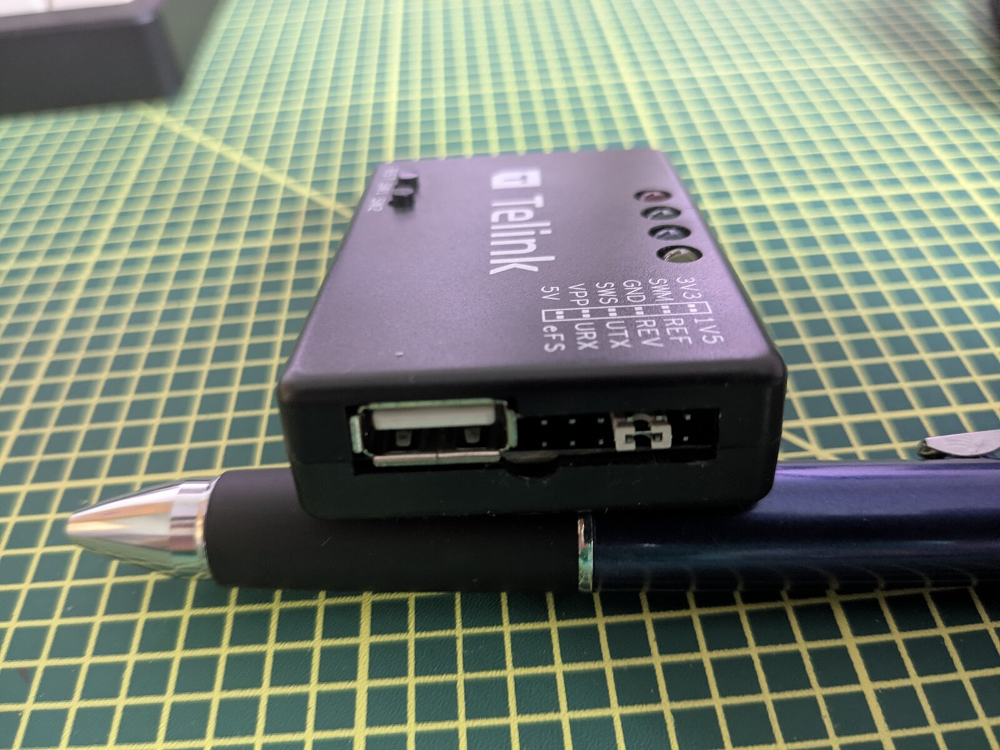

# Recovery — Telink burning board (SWS)

If a bad flash leaves the keyboard unresponsive (no USB enumeration, no DFU), the only
way back is the hardware **SWS** (Single-Wire Slave) debug interface with a Telink
burning board. This also is the only way to **read** the flash out (the USB OTA protocol
is write-only).

> This requires opening the keyboard and a Telink programmer. It's straightforward
> (3 wires) but it's hardware work — take your time.

---

## What you need

- **Telink Burning EVK** (`TLSRGSOCBK56B`) — the only confirmed SWS programmer for the
  B91 series. There is no open-source SWS tool for B91 (the pvvx/TLSRPGM-style tools are
  TLSR82xx only; an FTDI cannot bit-bang this protocol).
- **Telink BDT** (Burning and Debugging Tool) for Linux, v2.2.x, with **EVK firmware
  v4.7+**. Docs:
  <https://wiki.telink-semi.cn/wiki/IDE-and-Tools/BDT_for_TLSR9_Series_in_Linux/>
- A fine soldering iron or sharp probe leads, and the keyboard opened to expose the
  main PCB.

---

## The SWS test pads

Three small copper pads sit near the MCU on the **bottom side** of the main PCB. The
annotated photo shows their positions — **SWS** is on its own near the MCU, with
**VCC (3.3 V)** and **GND** as the pair on the other side:


| Signal | How to confirm with a meter / logic analyzer |
|--------|----------------------------------------------|
| **GND** | Constant LOW (0 V). |
| **VCC (3.3 V)** | Constant HIGH. |
| **SWS** (PA7) | On **battery**: ~80 ms LOW / ~275 ms HIGH sleep/wake cycling (~2.8 Hz). On USB: constant HIGH after ~1.2 s — so tell it apart from VCC on battery, where only SWS toggles. |

SWS is disabled in deep sleep, so the chip must be awake to talk to it (the `ac` command
below wakes it).

---

## Wiring

Three wires only. Match the EVK header pins to the labelled board pads:



| EVK pin | → | PCB pad |
|---------|---|---------|
| **SWM** | → | SWS |
| **GND** | → | GND |
| **3.3 V** | → | VCC |



The full setup — EVK wired to the opened keyboard:


Turn the keyboard's **wireless switch OFF** during programming (under the CapsLock
keycap). USB may stay connected for power, but battery-only is fine too.

---

## Software setup

```bash
cd reverse/tools
./sws_flash.sh setup          # install udev rules, check the EVK is detected
./sws_flash.sh evk-version    # confirm EVK firmware; evk-upgrade to v4.7 if older
```

The helper wraps BDT for the common operations (it expects BDT at
`reverse/tools/bdt/release/bdt`, which you download separately from Telink).

---

## Dump first, then write

**Always read a full backup before writing anything** — this is your stock-firmware
restore image and it captures your per-device calibration + Bluetooth MAC (at `0xFE000`).

```bash
./sws_flash.sh dump        # triple-reads the full 1 MB and verifies the reads match
./sws_flash.sh analyze     # extracts calibration / MAC info from the dump
```

Then flash what you need (the helper preserves the calibration + MAC region):

```bash
./sws_flash.sh flash ../../build/combined.bin   # write this ZMK firmware
./sws_flash.sh restore                           # write your stock backup back
```

### Raw BDT (equivalent, if you prefer)

```bash
cd reverse/tools/bdt/release
sudo ./bdt B91 ac                          # activate / wake the chip (required!)
sudo ./bdt B91 rf 0 0x100000 -o dump.bin   # read full 1 MB flash
sudo ./bdt B91 wf 0 -i firmware.bin        # write flash from 0x0
```
*(If `B91` doesn't take, try `9518` — BDT maps both to the same DUT.)*

---

## Gotchas

- **Deep sleep blocks SWS.** Always run `ac` first to wake the chip, or you'll get no
  response.
- **Wireless switch OFF** during programming.
- Writing to `0x0` overwrites the bootloader + app but **not** the calibration/MAC at
  `0xFE000` — the helper deliberately avoids that region. Don't `wf` over the whole
  chip with a 1 MB image unless you mean to.
- After a successful write, power-cycle (re-plug USB) to boot the new firmware.

Once USB enumeration is back, you can return to the normal USB flow in
[INSTALL.md](../INSTALL.md).
