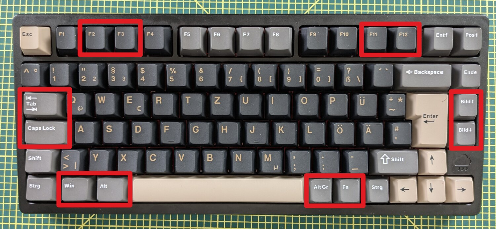
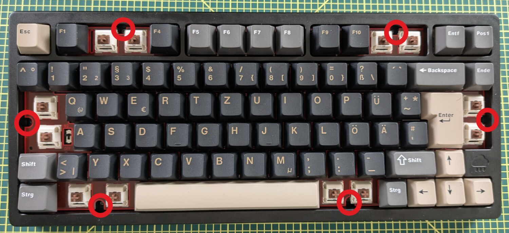
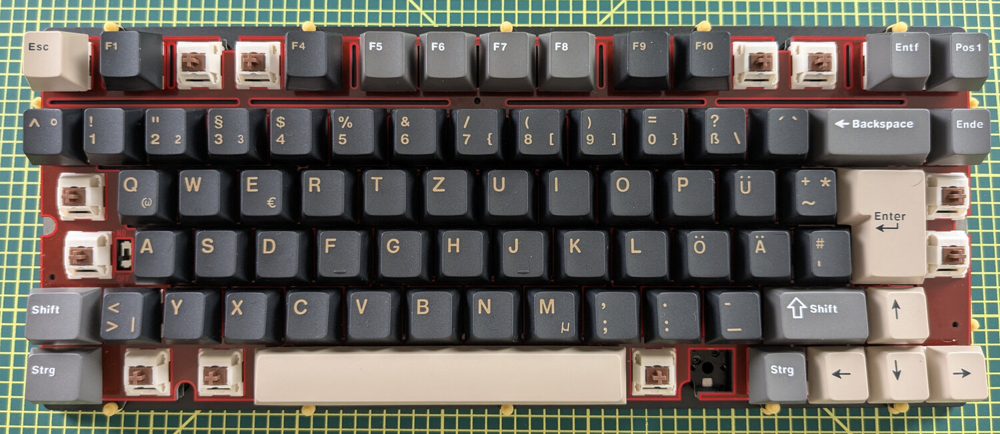
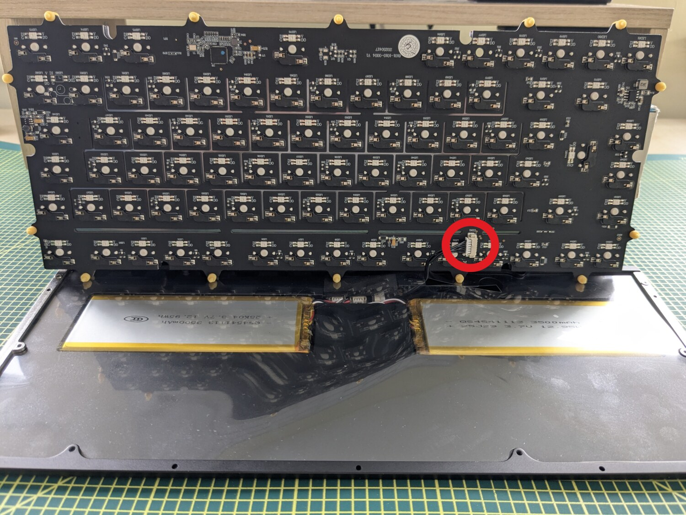
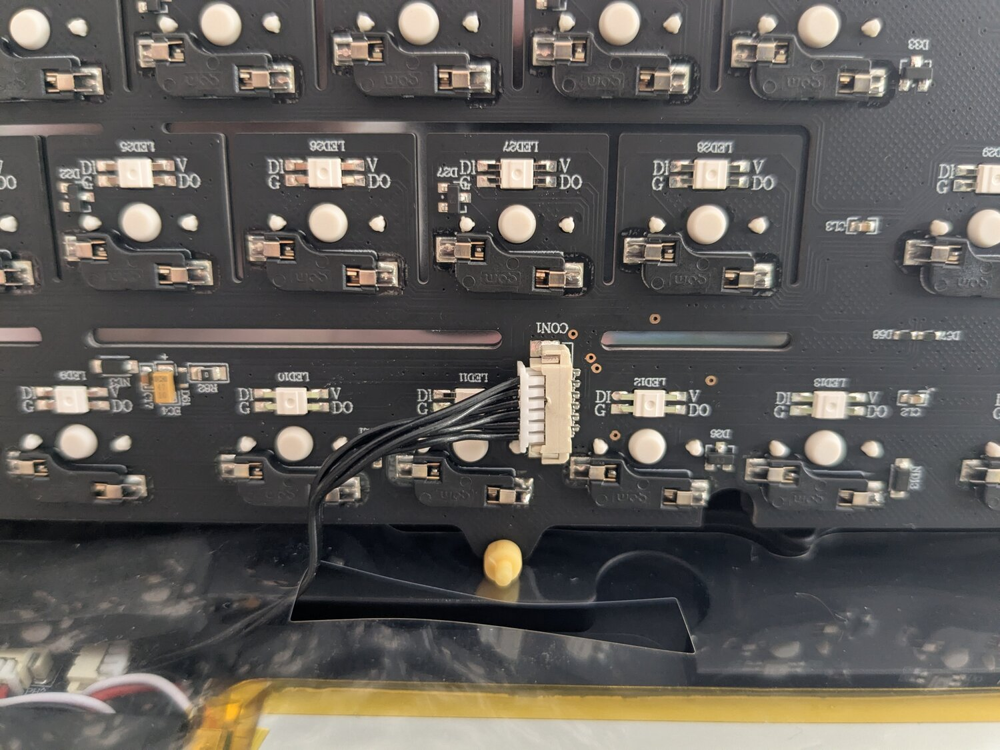
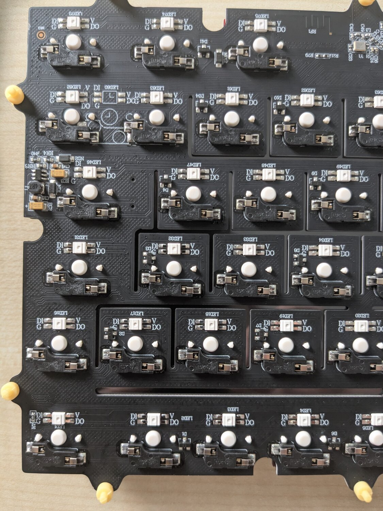
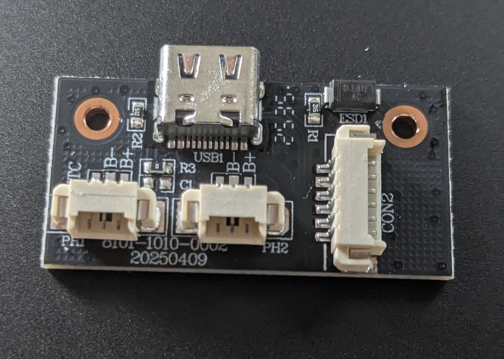

# Teardown

A photo walkthrough of opening the Rainy 75 Pro — to reach the SWS pads for
[firmware recovery](recovery.md), inspect the PCB, or service the battery.

> ### ⚠️ Battery safety
> There are **two LiPo cells** inside (2× 3500 mAh). Don't pinch, puncture, or short
> them, and disconnect the battery before probing the board. A swollen or damaged cell
> is a fire risk — stop and dispose of it properly.

---

## 1. Pull the screw keycaps

The case screws hide under keycaps. Pop off the marked caps (function-row pairs,
Tab/CapsLock, the PgUp/PgDn column, and the bottom-row modifiers):

## 2. Remove the revealed screws

With those caps off, the screws sit in the switch housings (circled):

## 3. Lift the top case

The top case separates, exposing the gasket-mounted plate and the PCB assembly (the red
plate is the gasket mount):

## 4. Disconnect the battery, lift the PCB

The two LiPo cells sit in the bottom case. **Unplug the battery/daughterboard connector
(circled)** before fully separating the PCB:

---

## The PCB

The back of the main PCB carries the **83 per-key WS2812 LEDs** (each with its
`DI · G · V · DO` pads — the serial RGB chain), the hot-swap switch sockets, and **CON1**,
the connector to the USB/battery daughterboard:

Full bare PCB:

## Daughterboard (USB-C + battery)

A small daughterboard carries the **USB-C** port (`USB1`), the **two battery connectors**
(`PH1` / `PH2` — one per LiPo cell), and **CON2**, the cable back to the main PCB:

---

## SWS programming pads

For firmware dumps and recovery, the **SWS / VCC / GND** pads are on the **bottom side of
the main PCB**, near the MCU. Full wiring and BDT usage in
**[recovery.md](recovery.md)**:

Hardware details (chip, GPIO matrix, RGB, connection modes) are in
[architecture.md](architecture.md) and [hardware-probing.md](hardware-probing.md).
